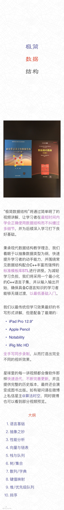

# 极简星球指南

本指南不断更新～

1. 初步计划每讲视频不超过15分钟，便于一次掌握一个知识点又不会带来太大的负担。
2. 星球里仅由我发帖，提问请微博私信我，尽可能减少消息提醒给大家带来的干扰。
3. 希望大家在微博话题 极简数据结构 发布自己的笔记和讨论，手写最佳，这样才能真正学懂理解。
4. 星球简介见附图。参考书是《面向算法设计的数据结构(C++语言版)》和《算法设计指南》，将来我们将出版《极简数据结构》一书。



## 星球介绍

“极简数据结构”将通过简单明了的视频讲解，让学习者在最短时间内学会正确使用数据结构而不纠缠过多细节，迅速进入实战体验，并为后续深入学习打下良好基础。

秉承现代数据结构教学理念，我们着眼于以抽象数据类型为纲，快速提升学习者的动手能力。为此，我们借助C++丰富而强悍的标准模板库STL，辅以简短的可执行代码展示常见数据结构的极致算法性能。为减轻学习负担，我们将采用一个最小化的C++语言子集，并从输入输出开始讲述，确保具备C语言知识的学习者能够无缝过渡，以最低基础入门。

我们以最传统但学习效果最好的书写形式讲解，但是配备了最潮的数字化设备：
```
iPad Pro 12.9”
Apple Pencil
Notability
iRig Mic HD
```
全手写同步录制，从而打造出完全不同的视听效果。

星球里的每一讲视频都会像软件那样快速迭代，不断完善更新，并且提供完整的历史版本，最终还会演变为图书出版物。如有疑问请在微博上私信星主@算法时空，同时微博也可以看到部分视频预览。

```
大纲:
语言基础
抽象之妙
性能分析
向量与链表
栈与队列
树/集合
散列/字典
键值映射
堆/优先级队列
排序
```

## 第1章 开发环境

为了降低大家的学习难度，我们所有的程序示例都是一个单独的cpp文件，例如叫ds.cpp。程序都会发布在GitHub：
链接：[GitHub:https://github.com/xiexiexx/BIDS](https://github.com/xiexiexx/BIDS)

1. 命令行方式

    对于安装了clang(强烈推荐)的朋友(当然你也可以用gcc)，只需执行一句：
    `clang++ -std=c++11 -stdlib=libc++ -O3 ds.cpp; ./a.out; rm a.out`
    或者
    `g++ -std=c++11 -stdlib=libstdc++ -O3 ds.cpp; ./a.out; rm a.out`
    唯一的参数是"`ds.cpp`"。你可以无脑操作，而不用管这些命令都是什么意思，执行完就可以看到执行结果啦~

2. Visual Studio

    使用Windows的朋友可以选择Visual Studio，推荐2017社区版：
    链接：[Downloads | IDE, Code, & Team Foundation Server | ...](https://www.visualstudio.com/downloads/)

    安装C++模块之后按照下面的流程：
    - 新建项目X(Win32控制台), 注意选项是空项目，然后将ds.cpp复制到该项目下。
    - 添加已有项选择ds.cpp到X这个项目。
    - 更改为release模式.
    - Ctrl + F5执行程序!
    - 执行时出现闪退问题的解决: 项目---属性---配置属性---链接器---系统---子系统(在窗口右边)---下拉框选择控制台(/SUBSYSTEM:CONSOLE)，再应用并确定即可。

    可以试试最简单的程序hello_world.cpp开始入门：
    链接：[BIDS/hello_world.cpp at master · xiexiexx/BIDS · G...](https://github.com/xiexiexx/BIDS/blob/master/iostream/hello_world.cpp)

是不是很简单？


### 第1讲 C++输入输出

快速讲解输入和输出，从C快速过渡到C++。

* 链接：[C++输入输出](http://v.youku.com/v_show/id_XMzUxODQ0MzE2OA==.html)
* 观看密码 uf3870hx

程序代码：

* 链接：[BIDS/hello_world.cpp](https://github.com/xiexiexx/BIDS/blob/master/iostream/hello_world.cpp)
* 链接：[a_plus_b.cpp](https://github.com/xiexiexx/BIDS/blob/master/iostream/a_plus_b.cpp)


### 第2讲 string的简单使用

了解string类的简单使用，初识类与对象的功用。

* 链接：[string简单使用](http://v.youku.com/v_show/id_XMzUyMDM5MTgwOA==.html)
* 观看密码 bv2268lk

程序代码：

* 链接：[BIDS/hello_name.cpp](https://github.com/xiexiexx/BIDS/blob/master/string/hello_name.cpp)

### 第3讲 数组和向量

从数组过渡到向量

* 链接：[数组和向量](http://v.youku.com/v_show/id_XMzUzMzM1NTYyOA==.html)
* 观看密码 fu9841up

程序代码：
* 链接：[BIDS/array_and_vector.cpp](https://github.com/xiexiexx/BIDS/blob/master/array/array_and_vector.cpp)

请学完之后在微博用 极简数据结构 主题发布学习笔记，一起极简主义！

### 第4讲 对角线问题

复习二维数组并讲解代码优化

* 链接：[对角线问题](http://v.youku.com/v_show/id_XMzUzMzM1ODk3Ng==.html)
* 观看密码 jv3080bv

程序代码：
* 链接：[BIDS/diagonal.cpp](https://github.com/xiexiexx/BIDS/blob/master/array/diagonal.cpp)

请学完之后在微博用 极简数据结构 主题发布学习笔记，一起极简主义！

### 第5讲 数组和向量的排序

* 链接：[数组和向量的排序](http://v.youku.com/v_show/id_XMzU0MzA5NjY0NA==.html)
* 观看密码 pv9760ph

程序代码：

* 链接：[BIDS/just_sort.cpp](https://github.com/xiexiexx/BIDS/blob/master/sort/just_sort.cpp)

请学完之后在微博用 极简数据结构 主题发布学习笔记，一起极简主义！


### 第6讲 二分查找原理

只有了解原理才能真正学懂二分查找

* 链接：[二分查找原理](http://v.youku.com/v_show/id_XMzU0MjY5MjExNg==.html)
* 观看密码 tp4392gv

请学完之后在微博用 极简数据结构 主题发布学习笔记，一起极简主义！

### 第7讲 数组二分查找

基于模板的代码

* 链接：[数组二分查找](http://v.youku.com/v_show/id_XMzU0MzA5OTAzMg==.html)
* 观看密码 yg5797kg

程序代码：

* 链接：[BIDS/binary_search_array.cpp](https://github.com/xiexiexx/BIDS/blob/master/array/binary_search_array.cpp)

请学完之后在微博用 极简数据结构 主题发布学习笔记，一起极简主义！

### 第8讲 向量二分查找

另一种区间约定，导致代码的差异。

* 链接：[向量二分查找](http://v.youku.com/v_show/id_XMzU0MzEwMDc4NA==.html)
* 观看密码 jh4199xs

程序代码：

* 链接：[BIDS/binary_search_vector.cpp](https://github.com/xiexiexx/BIDS/blob/master/vector/binary_search_vector.cpp)

请学完之后在微博用 极简数据结构 主题发布学习笔记，一起极简主义！


### 第9讲 3n + 1问题

我们讲解了两种方法，直接迭代求解和备忘录。这一讲有点长～

原有代码有点问题，向量元素赋值和返回值需要更改，请对照新代码并配合注释来看。

* 链接：[3n + 1问题](http://v.youku.com/v_show/id_XMzU2NjcxMTE4MA==.html)
* 观看密码 yh4321qp

程序代码：

* 链接：[BIDS/Collatz.cpp](https://github.com/xiexiexx/BIDS/blob/master/algorithm/Collatz.cpp)

请学完之后在微博用 极简数据结构  主题发布学习笔记，一起极简主义！


## 第2章

### 第10讲 抽象数据类型

第2章开始了~

* 链接：[抽象数据类型](http://v.youku.com/v_show/id_XMzU2Njk0NTc4MA==.html)
* 观看密码 dg2099zp

请学完之后在微博用 极简数据结构 主题发布学习笔记，一起极简主义！

### 第11讲 查找问题的抽象数据类型视角

从查找问题讲起

* 链接：[查找问题的抽象数据类型视角](http://v.youku.com/v_show/id_XMzU3NDcwNDA2NA==.html)
* 观看密码 yr3292fd

请学完之后在微博用 极简数据结构 主题发布学习笔记，一起极简主义！

### 第12讲 初识集合

set的基本用法

* 链接：[初识集合](http://v.youku.com/v_show/id_XMzU3NDcwOTcxNg==.html)
* 观看密码 jw3172dp

程序代码：

* 链接：[BIDS/set_example.cpp](https://github.com/xiexiexx/BIDS/blob/master/set/set_example.cpp)

请学完之后在微博用 极简数据结构 主题发布学习笔记，一起极简主义！

### 第13讲 集合中的次序统计量

寻找集合中第k小的元素

* 链接：[集合中的次序统计量](http://v.youku.com/v_show/id_XMzU5NTUwMjEyMA==.html)
* 观看密码 uy1392kp

程序代码：

* 链接：[BIDS/order_statistics_set.cpp](https://github.com/xiexiexx/BIDS/blob/master/set/order_statistics_set.cpp)

请学完之后在微博用 极简数据结构 主题发布学习笔记，一起极简主义！

### 第14讲 有序向量与无序向量

基于向量的功能实现多重集合

* 链接：[有序向量与无序向量](http://v.youku.com/v_show/id_XMzU5NTUwODAwNA==.html)
* 观看密码 pd4389xk

程序代码：

* 链接：[BIDS/sorted_vector_and_unsorted_vector.cpp](https://github.com/xiexiexx/BIDS/blob/master/vector/sorted_vector_and_unsorted_vector.cpp)

请学完之后在微博用 极简数据结构 主题发布学习笔记，一起极简主义！


### 第15讲 以集合描述算法

学会用集合的语言实现算法

* 链接：[以集合描述算法](http://v.youku.com/v_show/id_XMzYwNjA1NDYwNA==.html)
* 观看密码 xf4093zp

程序代码：

* 链接：[BIDS/description.cpp](https://github.com/xiexiexx/BIDS/blob/master/set/description.cpp)

请学完之后在微博用 极简数据结构 主题发布学习笔记，一起极简主义！

### 第16讲 STL容器一览

了解STL丰富多彩的数据结构实现

链接：[STL容器一览](http://v.youku.com/v_show/id_XMzYwNjA1ODYxNg==.html)

观看密码 ds3816jk

请学完之后在微博用 极简数据结构 主题发布学习笔记，一起极简主义！


## 第3章

### 第17讲 时空之谜

运行时间和占用空间

* 链接：[时空之谜](http://v.youku.com/v_show/id_XMzYxODk5NzY3Mg==.html)
* 观看密码 yf8471dp

请学完之后在微博用 极简数据结构 主题发布学习笔记，一起极简主义！

### 第18讲 程序运行时间

不同类型控制语句的运行时间

* 链接：[程序运行时间](http://v.youku.com/v_show/id_XMzYzMTYxNDgyOA==.html)
* 观看密码 fd1208sk

请学完之后在微博用 极简数据结构 主题发布学习笔记，一起极简主义！

### 第19讲 量级

用简单的语言讲解函数的量级

* 链接：[量级](http://v.youku.com/v_show/id_XMzYzNzU2MzA2NA==.html)
* 观看密码 fp3981gh

请学完之后在微博用 极简数据结构 主题发布学习笔记，一起极简主义！

### 第20讲 常见运行时间

给出代码并分析常见运行时间

* 链接：[常见运行时间](http://v.youku.com/v_show/id_XMzY0MTE2ODcyOA==.html)
* 观看密码 fd3298aj

代码：

* 链接：[BIDS/common_running_times.cpp](https://github.com/xiexiexx/BIDS/blob/master/algorithm/common_running_times.cpp)

请学完之后在微博用 极简数据结构 主题发布学习笔记，一起极简主义！

### 第21讲 运行时间的差异

对比各种时间的巨大差异并给出渐近记号的两个定理。

* 链接：[时间差异](http://v.youku.com/v_show/id_XMzY0MTE3MTcyNA==.html)
* 观看密码 df6591md

请学完之后在微博用 极简数据结构 主题发布学习笔记，一起极简主义！

### 第22讲 抽象数据类型的性能

分析抽象数据类型的使用

* 链接：[抽象数据类型的性能](https://v.youku.com/v_show/id_XMzY1NDc2NTEwNA==.html)
* 观看密码 fq3291sq

请学完之后在微博用 极简数据结构 主题发布学习笔记，一起极简主义！

### 第23讲 抽象数据类型选用

突然发现漏掉了这一讲

* 链接：[抽象数据类型选用](https://v.youku.com/v_show/id_XMzY4MjAwNzAwNA==.html)
* 观看密码 xp3028zk

请学完之后在微博用 极简数据结构 主题发布学习笔记，一起极简主义！

### 第24讲 向量用法

系统讲解向量用法

* 链接：[向量用法](https://v.youku.com/v_show/id_XMzY3MjA2MDQwNA==.html)
* 观看密码 xy3902pq

代码：

* 链接：[BIDS/vector_example.cpp](https://github.com/xiexiexx/BIDS/blob/master/vector/vector_example.cpp)

请学完之后在微博用 极简数据结构   主题发布学习笔记，一起极简主义！

### 第25讲 容量之妙

向量容量是高效的来源

* 链接：[容量之妙](https://v.youku.com/v_show/id_XMzY3MjA2OTYwNA==.html)
* 观看密码 ps3219vd

代码：

* 链接：[BIDS/doubling.cpp](https://github.com/xiexiexx/BIDS/blob/master/vector/doubling.cpp)

请学完之后在微博用 极简数据结构 主题发布学习笔记，一起极简主义！


## 第4章

### 第26讲 自然数映射与下标

仔细体会这种技术的妙处

* 链接：[自然数映射与下标](https://v.youku.com/v_show/id_XMzY4NDAwNDM5Mg==.html)
* 观看密码 gp3932cq

请学完之后在微博用 极简数据结构 主题发布学习笔记，一起极简主义！

### 第27讲 初识链表

forward_list和list的使用

* 链接：[初识链表](https://v.youku.com/v_show/id_XMzcxMzQ0MzM5Mg==.html)
* 观看密码 ff9431sp

代码：

* 链接：[BIDS/list_example.cpp](https://github.com/xiexiexx/BIDS/blob/master/list/list_example.cpp)

请学完之后在微博用 极简数据结构 主题发布学习笔记，一起极简主义！

### 第28讲 链表操作

插入、删除、查找和移动

* 链接：[链表操作](https://v.youku.com/v_show/id_XMzcyMzQzNzgxNg==.html)
* 观看密码 fs4389xk

代码：

* 链接：[BIDS/insert_erase_splice_find.cpp](https://github.com/xiexiexx/BIDS/blob/master/list/insert_erase_splice_find.cpp)

请学完之后在微博用 极简数据结构 主题发布学习笔记，一起极简主义！

### 第29讲 结点链接

数据与链接的实现

* 链接：[结点链接](https://v.youku.com/v_show/id_XMzc0MDY0MzQ4NA==.html)
* 观看密码 id8913sf

代码：

* 链接：[BIDS/slist.cpp](https://github.com/xiexiexx/BIDS/blob/master/forward_list/slist.cpp)

请学完之后在微博用 极简数据结构 主题发布学习笔记，一起极简主义！

### 第30讲 单链实例

简单的链表实例

* 链接：[单链实例](https://v.youku.com/v_show/id_XMzc0MDY2ODk3Mg==.html)
* 观看密码 ph3998sd

代码：

* 链接：[BIDS/slist.cpp](https://github.com/xiexiexx/BIDS/blob/master/forward_list/slist.cpp)

请学完之后在微博用 极简数据结构 主题发布学习笔记，一起极简主义！

### 第31讲 逆置单链

就地逆置链表

修订：视频里最后应是forward_list<int> FL，不过GitHub代码无误。

* 链接：[逆置单链](https://v.youku.com/v_show/id_XMzc1Njc5MTc4OA==.html)
* 观看密码 tp2981zq

代码：

* 链接：[BIDS/reverse.cpp](https://github.com/xiexiexx/BIDS/blob/master/forward_list/reverse.cpp)

请学完之后在微博用 极简数据结构 主题发布学习笔记，一起极简主义！

### 第32讲 连续放入

不同体积的元素，连续放入向量和链表，速度有何差异？

* 链接：[连续放入](https://v.youku.com/v_show/id_XMzc2ODEyMjYwMA==.html)
* 观看密码 ug3256zg

代码：

* 链接：[BIDS/handwritten_push_back.cpp](https://github.com/xiexiexx/BIDS/blob/master/forward_list/handwritten_push_back.cpp)
* 链接：[BIDS/int_push_back.cpp](https://github.com/xiexiexx/BIDS/blob/master/vector/int_push_back.cpp)
* 链接：[BIDS/pointer_push_back.cpp](https://github.com/xiexiexx/BIDS/blob/master/vector/pointer_push_back.cpp)
* 链接：[BIDS/struct_push_back.cpp](https://github.com/xiexiexx/BIDS/blob/master/vector/struct_push_back.cpp)

请学完之后在微博用 极简数据结构 主题发布学习笔记，一起极简主义！


## 第5章

### 第33讲 栈与队列

简要讲解使用方法

* 链接：[栈和队列](https://v.youku.com/v_show/id_XMzc4MDkxODc2MA==.html)
* 观看密码 fd2381sj

请学完之后在微博用 极简数据结构 主题发布学习笔记，一起极简主义！

### 第34讲 进制转换

利用栈和映射转换进制

* 链接：[进制转换](https://v.youku.com/v_show/id_XMzc4MDkyMTkwOA==.html)
* 观看密码 gr8481tu

代码:

* 链接：[BIDS/number_convertor.cpp](https://github.com/xiexiexx/BIDS/blob/master/stack/number_convertor.cpp)

请学完之后在微博用 极简数据结构 主题发布学习笔记，一起极简主义！

### 第35讲 循环队列

讲清来龙去脉

另：17:30处的代码应该改成if (y &lt; N - 1)

* 链接：[循环队列](https://v.youku.com/v_show/id_XMzc5MDA5NzI1Ng==.html)
* 观看密码 gy2476fd

代码：

* 链接：[BIDS/buffer.cpp](https://github.com/xiexiexx/BIDS/blob/master/queue/buffer.cpp)

请学完之后在微博用 极简数据结构 主题发布学习笔记，一起极简主义！

### 第36讲 基数排序

讲解原理

* 链接：[基数排序](https://v.youku.com/v_show/id_XMzc5MDEwMTMwMA==.html)
* 观看密码 pv2389ty

请学完之后在微博用 极简数据结构 主题发布学习笔记，一起极简主义！

### 第37讲 电话号码排序

代码技巧很重要

* 链接：[电话号码排序](https://v.youku.com/v_show/id_XMzgwMTg3NTE3Mg==.html)
* 观看密码 gr2437up

代码:

* 链接：[BIDS/phone.cpp](https://github.com/xiexiexx/BIDS/blob/master/queue/phone.cpp)

请学完之后在微博用 极简数据结构 主题发布学习笔记，一起极简主义！

### 第38讲 括号匹配

这是一道leetcode题

* 链接：[括号匹配](https://v.youku.com/v_show/id_XMzgwMTg3NzYwMA==.html)
* 观看密码 wr4987ka

代码:

* 链接：[BIDS/brackets_validator.cpp](https://github.com/xiexiexx/BIDS/blob/master/stack/brackets_validator.cpp)
* 链接：[BIDS/generalized_validator.cpp](https://github.com/xiexiexx/BIDS/blob/master/stack/generalized_validator.cpp)

请学完之后在微博用 极简数据结构 主题发布学习笔记，一起极简主义！

### 第39讲 迷宫问题

讲解基本数据组织

* 链接：[迷宫问题](https://v.youku.com/v_show/id_XMzgwMTg3ODgxMg==.html)
* 观看密码 pr3985zw

请学完之后在微博用 极简数据结构 主题发布学习笔记，一起极简主义！

### 第40讲 以栈求解迷宫

DFS

* 链接：[以栈求解迷宫](https://v.youku.com/v_show/id_XMzgxMTYzMDMxMg==.html)
* 观看密码 ds9328uj

代码：

* 链接：[BIDS/maze_with_stack.cpp](https://github.com/xiexiexx/BIDS/blob/master/stack/maze_with_stack.cpp)

请学完之后在微博用 极简数据结构 主题发布学习笔记，一起极简主义！

### 第41讲 以队列求解迷宫

BFS

* 链接：[以队列求解迷宫](https://v.youku.com/v_show/id_XMzgxMTYzMzQzNg==.html)
* 观看密码 px3201wj

代码：

* 链接：[BIDS/maze_with_queue.cpp](https://github.com/xiexiexx/BIDS/blob/master/queue/maze_with_queue.cpp)

请学完之后在微博用 极简数据结构  主题发布学习笔记，一起极简主义！


## 第6章

### 第42讲 二叉树

简介

* 链接：[二叉树](http://v.youku.com/v_show/id_XMzgxOTgyODk0OA==.html)
* 观看密码 fp2392dz

请学完之后在微博用 极简数据结构  主题发布学习笔记，一起极简主义！

### 第43讲 树的存储

如何存储树结构

* 链接：[树的存储](http://v.youku.com/v_show/id_XMzgxOTgzMjA2OA==.html)
* 观看密码 yw3289vx

请学完之后在微博用  极简数据结构  主题发布学习笔记，一起极简主义！
